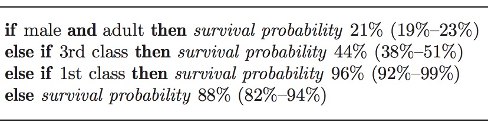

# Intro to Explainable AI 

The field of Explainable AI (or XAI) is a relatively new and evolving. As we apply ML in more critical fields, the desire to understand why ML models make certain decisions become more urgent. I will go over some basic ideas and concepts in it and explore open questions 

I draw many of the concepts from 

* [Explainable Artificial Intelligence: From Simple Predictors to Complex Generative Models](https://interpretable-ml-class.github.io/) Spring 2023, Harvard University
	* YT videos of the previous workshop series at [Stanford Seminar](https://www.youtube.com/playlist?list=PLoROMvodv4rPh6wa6PGcHH6vMG9sEIPxL). 
* Book: https://christophm.github.io/interpretable-ml-book/

# Inherently Interpretable Models

Simpler models have limited parameters and we can somehow explain it, with following method 

- Bayesian Rule Lists: Generative Model
- Risk Scores
- GAMs and GA^2Ms: Generalized Additive Models
- Prototype Selection for Interpretable Classification
- Prototype Layers in Deep Learning Models
- Attention Layers in DL models - context vector

## Bayesian Rule Lists uses the generation algorithm 

:page_facing_up: "Interpretable classifiers using rules and bayesian analysis: Building a better stroke prediction model." (2015): 1350-1371. Letham, Benjamin, Cynthia Rudin, Tyler H. McCormick, and David Madigan. 

For example, Decision list for Titanic. In parentheses is the 95% credible interval for the survival probability.

BRL Produces a posterior distribution over permutations of if.. then.. Else-if.. rules from a large set of pre-mined rules.
Decision lists with high posterior probability tend to be both accurate and interpretable.   

* Prior favors concise lists with small number of rules and fewer terms in left hand side

A major source of practical feasibility: pre-mined rules: 
1) Reduces model space; 
2) Complexity of problem depends on number of pre-mined rules.

**Sample Implementations - Simplified** :

1. **Discretization**: Continuous features are discretized into bins.
2. **Rule Generation**: Association rule mining techniques (like frequent itemset mining) are used to generate rules.
	- `apriori` from the `mlxtend` package is used to mine frequent itemsets from the discretized data.
	- `association_rules` is then used to generate rules based on these itemsets.
3. **Rule Selection**: Bayesian analysis is applied to select a subset of rules that balance interpretability and predictive performance.
4. **Decision List Construction**: The rules are ordered to create a decision list. Each rule is a condition that, if satisfied, leads to a prediction.
5. **Prediction**: A custom function applies the decision list to the test data to make predictions.

[code](notebooks/bayesian_rule_lists.ipynb)

Related chapter in iML-book: 
https://christophm.github.io/interpretable-ml-book/rules.html

# Post hoc Explanation Methods 

* Local Explanations
	* Feature Importance using LIME
	* Feature Importance using SHAP 
	* Rule-based: Anchors 
	* Saliency Map 
* Global Explanations 
	* Collection of Local Explanations 
	* Representation Based
	* Model Distillation
	* Summaries of Counterfactual 

**Local vs. Global Explanations** 	

# Evaluating Model Interpretations/Explanations 

# Pitfalls and Limitations 

# From classification to Large Models 

# Mechanistic Interpretability and Compiled Transformers 

